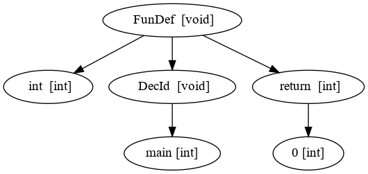

# Compilador

Projeto de uma linguagem denominada GOL e de seu respectivo compilador (fase de síntese) com geração de código de três endereços.


Autor: Michelangelo da Rocha Machado

# Linguagem
## Efeito de algumas operações:

As operações a seguir foram derivadas de algumas das operações
básicas encontradas na biblioteca Ngraph para lidar com grafos em C++.

```c
graph G1; //Declaração de variável do tipo graph
graph G2;
graph G3;
int a = 13;

G1 << a; //Inserção de vértice 13 no grafo G1
G1 << (a,14); //Inserção de aresta (13,14) no grafo G1
G2 << 15; //Inserção de vértice 15 no grafo G2
G3 = G1 + G2; //G3 recebe união dos grafos G1 e G2
G2 = G3[G1]; //G2 recebe subgrafo de G3 composto por vértices de G1
a = G3@13#; //a recebe o grau de entrada do nó 13
a = G3#13@; //a recebe o grau de saída do nó 13
G3 = G1&13&; //G3 recebe grafo composto pelos vizinhos do nó 13 no grafo G1
```

## Notas:

Os únicos tipos numéricos são: ‘int’ e ‘float’; Não existe sobrecarga
de nomes de funções; Em um ‘if’, o ‘else' estará associado com o ‘if’
mais recente; Expressões matemáticas são avaliadas em ordem
consistente com aquelas da matemática; O tipo grafo armazena grafos
direcionados sem repetição de arestas; O tamanho máximo de um
identificador é 31 caracteres; As declarações de variáveis devem
constar antes dos statements;

# Codigo:

O programa pode gerar a árvore nas seguintes formas:
1. Texto puro
2. Visual
2.1. Codigo .dot que pode ser copiado para algum site (e.g. ) 
2.2. Arquivo .dot que pode ser usado para gerar uma imagem com comando graphviz: ```dot dot -Tpng Arvore.dot -o Arvore.png ```

\*Para utilizar o graphviz, instale na sua máquina através do comando: ```sudo apt install graphviz```

Exemplo de imagem gerada a partir do código exemplo:
```c
int func1(int a, double b, graph c)
{
	return 0;
}

int func2()
{
	return 0;
}
```

