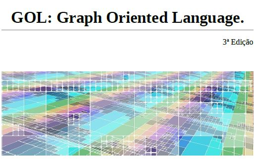

Design of a language called GOL and its respective compiler (synthesis phase) with three-address code generation.

Author: Michelangelo da Rocha Machado.

# Project Todo
- [x] Lexical Analysis
- [x] Syntax analisys
- [x] Semantic analysis
- [x] Intermediate code generation
- [ ] EN translation

# Language
## Documentation (pt-br only):
[GOL Language Documentation](https://github.com/michelangelo246/Compilador/blob/master/Doc/14_0156089_tradutor.pdf)

## Description of the main operations:

The following operations were derivated from the basic operations found in the Ngraph library to handle Graphs in C++.

```c
graph G1; // var declaration of type graph
graph G2;
graph G3;
int a = 13;

G1 << a; // Insertion of vertex 13 in graph G1
G1 << (a,14); // Insertion of edge (13.14) in graph G1
G2 << 15; // Insertion of vertex 15 in graph G2
a = G3@(13)#; // a receives the input degree of node 13
a = G3#(13)@; // a receives the output degree of node 13
G3 = G1&(13)&; //G3 receives the graph composed by node 13 neighbors in graph G1
```
Removed operations:
* ~~G3 = G1 + G2; // G3 receives the union of graphs G1 and G2~~
* ~~G2 = G3[(G1)]; // G2 receives subgraph of G3 composed of vertices of G1~~

## Notas:

Os únicos tipos numéricos são: ‘int’ e ‘float’; Não existe sobrecarga de nomes de funções; Em um ‘if’, o ‘else' estará associado com o ‘if’ mais recente; Expressões matemáticas são avaliadas em ordem consistente com aquelas da matemática; O tipo grafo armazena grafos direcionados com repetição de arestas; O tamanho máximo de um identificador é 31 caracteres; As declarações de variáveis devem constar antes dos statements e somente no escopo global ou de uma função; Grafos não podem ser declarados globalmente;

# Codigo:

O programa pode gerar a árvore sintática abstrata (AST) nas seguintes formas:
1. Texto puro **
2. Codigo .dot que pode ser copiado para algum site (e.g. [webgraphviz](http://www.webgraphviz.com/)) 
3. Arquivo .dot que pode ser usado para gerar uma imagem com comando graphviz: ```dot -Tpng Arvore.dot -o Arvore.png ```*

\* Para utilizar o graphviz, instale-o na sua máquina através do comando: ```sudo apt install graphviz```

\*\* Descontinuado

## AST:
AST gerada a partir de código exemplo:

| Codigo        | AST           |
| ------------- |:-------------:|
|       | 

## Geração de código:
O programa gera como saída um arquivo de extensão '.tac' o qual pode ser interpretado através da extração do interpretador TAC, contido no diretório de mesmo nome. O interpretador também pode ser baixado através do repositório do autor: https://github.com/lhsantos/tac.

| Código GOL    | Código gerado (fragmento) |
| ------------- |:-------------:|
|       | 
